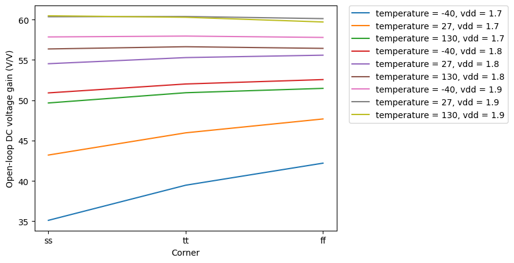
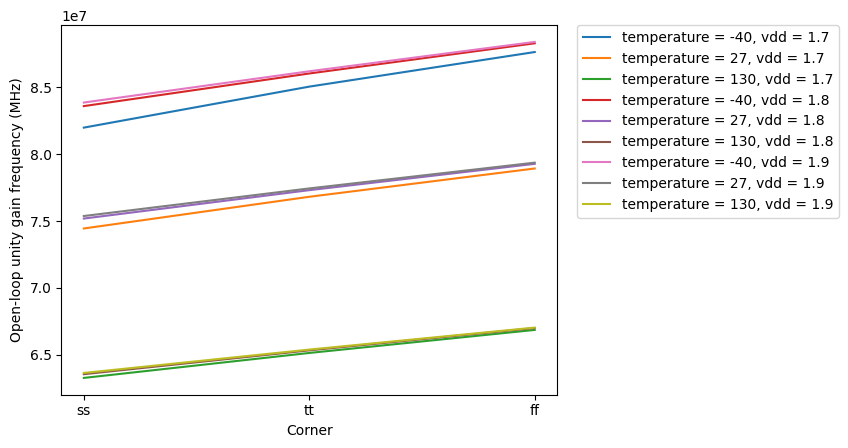
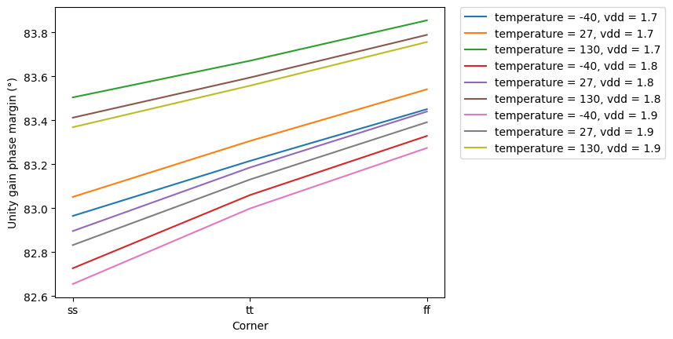
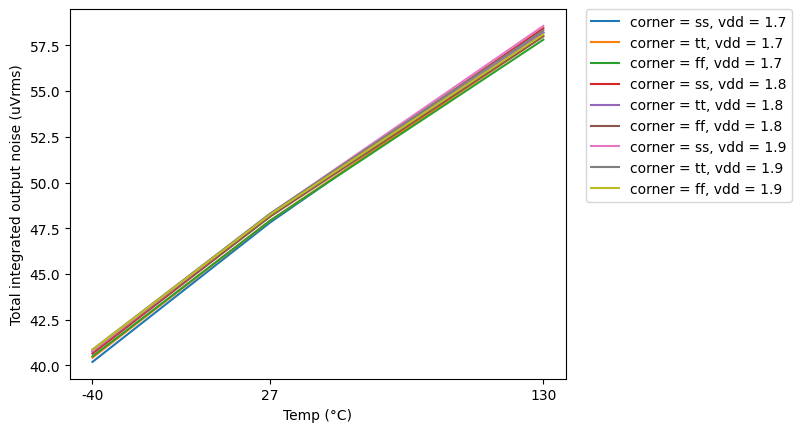

# CACE Summary for ota-5t-buf

**netlist source**: schematic

|      Parameter       |         Tool         |     Result      | Min Limit  |  Min Value   | Typ Target |  Typ Value   | Max Limit  |  Max Value   |  Status  |
| :------------------- | :------------------- | :-------------- | ---------: | -----------: | ---------: | -----------: | ---------: | -----------: | :------: |
| Open-loop DC voltage gain | ngspice              | a0                   |          30 V/V | 35.115 V/V |          any | 55.289 V/V |          any | 60.471 V/V |   Pass ✅    |
| Open-loop unity gain frequency | ngspice              | ugf                  |             any | 63.251 MHz |          any | 77.309 MHz |          any | 88.408 MHz |   Pass ✅    |
| Unity gain phase margin | ngspice              | pm                   |            80 ° |   82.656 ° |          any |   83.329 ° |          any |   83.855 ° |   Pass ✅    |
| Total integrated output noise | ngspice              | noi                  |             any | 40.185 uVrms |          any | 48.148 uVrms |     60 uVrms | 58.566 uVrms |   Pass ✅    |

## Plots

## gain_vs_corner

## ugf_vs_corner

## pm_vs_corner

## noise_vs_temperature

